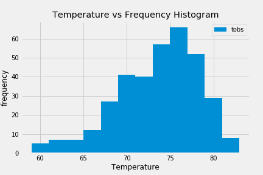
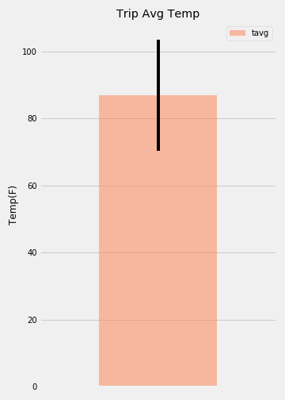

# Surfs Up!

Project outline of what we need to do.

## Climate Analysis and Exploration

We used Python and SQLAlchemy to do basic climate analysis and data exploration of our climate database. 

* Choose a start date and end date for our trip approximately 3-15 days total.

* Use SQLAlchemy `create_engine` to connect to our sqlite database.

* Use SQLAlchemy `automap_base()` to reflect our tables into classes and save a reference to those classes called `Station` and `Measurement`.

### Precipitation Analysis

* Design a query to retrieve the last 12 months of precipitation data.

* Select only the `date` and `prcp` values.

* Load the query results into a Pandas DataFrame and set the index to the date column.

* Sort the DataFrame values by `date`.

* Plot the results using the DataFrame `plot` method.

* Use Pandas to print the summary statistics for the precipitation data.

### Station Analysis

  * stations and observation counts in descending order.

  * station has the highest number of observations?

* Design a query to retrieve the last 12 months of temperature observation data (tobs).

  * Filter by the station with the highest number of observations.

  * Plot the results as a histogram with `bins=12`.

#### We Used :
FLASK ,
SQLAlchemy ORM queries, 
Pandas, and Matplotlib.

Data Boot Camp ©2019. All Rights Reserved.
